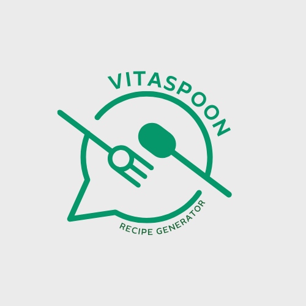

# 🥄 VitaSpoon | Generador de Recetas Personalizadas

[](https://astro.build/)
[](https://react.dev/)
[](https://tailwindcss.com/)
[](https://www.typescriptlang.org/)
[](https://opensource.org/licenses/MIT)



## 🌟 Descripción

VitaSpoon es un asistente de cocina impulsado por inteligencia artificial que genera recetas personalizadas basadas en tus preferencias alimenticias, restricciones dietéticas, ingredientes disponibles y equipamiento de cocina. Diseñado especialmente para adaptarse a diversas necesidades, incluyendo usuarios con acceso limitado a internet o electricidad.

**Demo:** [https://vitaspoon.vercel.app](https://vitaspoon.vercel.app)

## 🚀 Características principales

- **Recetas personalizadas** basadas en preferencias del usuario
- **Adaptación a restricciones dietéticas** (alergias, dietas especiales)
- **Aprovechamiento de ingredientes disponibles** en tu despensa
- **Opciones para cocina sin electricidad** (ideal para campamentos o zonas rurales)
- **Modo offline** con recetas precargadas cuando no hay internet
- **Compatibilidad regional** con soluciones especiales para usuarios en Cuba y otras zonas con conectividad limitada
- **Interfaz intuitiva y accesible** diseñada para todos los niveles de experiencia culinaria

## 🧩 Tecnologías

- **Frontend:** Astro, React, Tailwind CSS, TypeScript
- **Almacenamiento:** Local Storage (guardado de recetas favoritas)
- **APIs de IA:** OpenAI, Google Gemini, OpenRouter (DeepSeek)
- **Despliegue:** Vercel

## 🛠️ Instalación

1. **Clonar el repositorio**

```bash
git clone https://github.com/tu-usuario/vitaspoon.git
cd vitaspoon
```

2. **Instalar dependencias**

```bash
pnpm install
```

3. **Configurar variables de entorno**

Crea un archivo `.env` en la raíz del proyecto con las siguientes variables:

```
# API de OpenAI (GPT-4o-mini - opcional)
OPENAI_API_KEY=tu_api_key_aquí

# API de Google Gemini (opcional)
GEMINI_API_KEY=tu_api_key_aquí

# API de OpenRouter para acceder a DeepSeek (recomendado para usuarios en Cuba)
DEEPSEEK_API_KEY=tu_api_key_aquí
```

4. **Iniciar el servidor de desarrollo**

```bash
pnpm dev
```

5. **Construir para producción**

```bash
pnpm build
```

## 📊 Orden de prioridad de APIs

VitaSpoon utiliza la siguiente jerarquía para acceder a servicios de IA:

1. **OpenAI** (GPT-4o-mini) - Ofrece la mayor precisión y calidad
2. **Google Gemini** - Alternativa gratuita con buena calidad de resultados
3. **OpenRouter (DeepSeek)** - Excelente opción accesible desde Cuba
4. **Generación local** - Funciona sin conexión a internet

El sistema detecta automáticamente la ubicación del usuario y su acceso a servicios, priorizando DeepSeek para usuarios en Cuba.

## 🔍 Obtener API Keys

- **OpenAI:** [https://platform.openai.com/api-keys](https://platform.openai.com/api-keys)
- **Google Gemini:** [https://aistudio.google.com/app/apikey](https://aistudio.google.com/app/apikey)
- **OpenRouter:** [https://openrouter.ai/keys](https://openrouter.ai/keys)

## 🤝 Contribuciones

Las contribuciones son bienvenidas. Si encuentras un bug o tienes una idea para mejorar la aplicación:

1. Crea un fork del repositorio
2. Crea una rama con tu feature (`git checkout -b feature/amazing-feature`)
3. Haz commit de tus cambios (`git commit -m 'Add some amazing feature'`)
4. Haz push a la rama (`git push origin feature/amazing-feature`)
5. Abre un Pull Request

## 📝 Licencia

Este proyecto está bajo la Licencia MIT - ver el archivo [LICENSE](LICENSE) para más detalles.

## 📧 Contacto

¿Preguntas o sugerencias? Contáctanos en [thejasondev@icloud.com](mailto:thejasondev@icloud.com)

---

Desarrollado por @thejasondev para hacer la cocina más accesible para todos.
